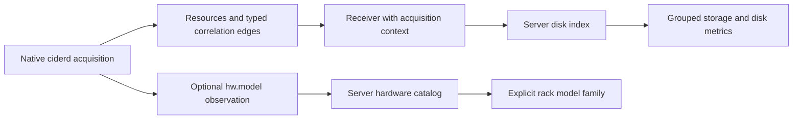

# Disk and hardware-model integration design

Date: 2026-09-12. Status: proposed implementation; no feature code changed by this plan.

The user selected **“Keep explicit enrollment; complete disk/model integration.”**
This design addresses the gaps in [the functionality verification](../../functional-verification.md).
The [implementation plan](../plans/2026-09-12-disk-model-integration.md) supplies the task sequence and checks.

## Scope and acceptance

| Requirement | Existing behavior to preserve | Work in this design |
| --- | --- | --- |
| 1. Individually view each daemon's disks and metrics, plus cluster aggregates | Distinct enrolled identities, host views, current aggregates, empty/offline states | One physical-disk view with confirmed driver metrics, raw observation access, and browser-session disk charts |
| 2. Group volumes without duplicating disks | Physical/APFS resource graph and capacity deduplication | Complete driver/mount correlation; one canonical disk/container/volume presentation, including shared pools |
| 3. Add joining nodes to topology | Explicitly enrolled nodes already appear through polling | Preserve automatic updates; page the rack beyond its current 24-model limit |
| 3a. Identify and render MacBook and Mac mini | Existing laptop and iMac meshes | Collect hardware identifier, classify it centrally from an exact catalog, add Mac mini and neutral unknown meshes |

“No selection” means the Overview aggregate. “No connected daemons” means zero
current contributors: capacity and I/O are Unknown, with explicit coverage.
Retained offline hosts and dated observations remain inspectable.

## Global constraints

- Target Apple Silicon macOS; keep the current Rust workspace and static JavaScript frontend.
- Keep heartbeats at 5 seconds. Keep visible core polling at 5 seconds after completion and hidden polling at 30 seconds.
- Keep explicit TLS configuration and enrollment. Do not add LAN discovery or automatic enrollment.
- Run native collection only in ciderd, never in the central server.
- Preserve enrolled node UUIDs, resource UUIDs, boot/session/generation boundaries, exact u128 counter handling, and idempotent batches.
- Missing, ambiguous, unavailable, and stale observations must not become measured zeroes.
- Do not sum APFS shared pools, repeated mounts, or shared NFS capacity twice.
- Preserve existing raw inventory, metric, authentication, and pagination contracts; new read fields/routes are additive.
- Keep the rack rendering budget at 24 models per page; make every enrolled node reachable.
- Web assets are embedded at compile time; rebuild the server after web changes.
- Do not commit, push, package, deploy, or interrupt the user's running test session as part of planning.
- During API implementation, update the shared Server Spec in native Google Docs formatting; a local document is not its substitute.

## Architecture and alternatives

Use collector evidence and a server-owned disk projection. Frontend-only grouping
cannot recover absent driver/mount associations and would duplicate capacity and
ownership rules. Replacing the wire inventory with nested disks would disrupt
existing identities and poorly represent pools backed by several disks.

The collector establishes evidence. The server resolves physical ownership and
selects metric sources. The browser presents that answer; it does not infer
ownership from a hostname, BSD prefix, flattened `parent_ids`, or `kind=device`.

## Collector correlation and lifecycle

### Physical disk and driver

Extend the existing IOKit worker to report each IOBlockStorageDriver's direct
IOMedia children, including their own Whole flag, BSD name and registry entry
ID. Keep existing driver resources, raw counters and source epochs unchanged.
Mapping failure is separate from statistics acquisition failure.

A derived-topology reconciler emits `driver --attached_to--> physical_device`
only when whole-media evidence matches exactly one current
`diskutil.list.physical` resource. Whole media alone is insufficient: virtual
and layered devices can also be whole media. Multiple candidate drivers for one
disk, multiple physical candidates, missing evidence and conflicting evidence
produce explicit unresolved/ambiguous states. Do not fan out one driver's total
to several disks or add several layers of one disk.

Reconcile after accepted source inventory changes, irrespective of arrival order.
The reconciliation group owns only its derived edges, not physical resources
owned by another collector. Confirmed removal removes edges; failed refreshes
retain dated evidence as stale. Reject results from a previous boot, agent
session, or mount generation. Refreshing identical evidence must not reset an
unchanged driver's counter series.

### Volumes and mounts

Retain the existing physical disk → partition/store → APFS container → volume
graph. Resolve ordinary local mount locators by exact identity. For APFS boot
snapshots and aliases, add a bounded Disk Arbitration worker that acquires volume
UUID, media BSD name and available IOMedia identity for a known local mount.
Validate expected fsid and mount source before and after lookup. Never send
network mounts to this path and never strip an `s…` suffix to guess a parent.

**Native proof gate:** exercise the proposed adapter on the current boot snapshot
and an ordinary mounted volume before relying on its output. It must yield a
unique identity consistent with the existing diskutil graph. Public documentation
does not guarantee boot-snapshot behavior. If this proof fails, preserve Unknown
and revise the adapter with captured evidence before claiming complete boot-volume
integration. A unit fixture alone cannot close this gate.

Emit `mount --mounts--> filesystem` for a confirmed match; represent snapshot
ancestry with `snapshot_of` when independently established. Duplicate volume UUIDs,
mount replacement during lookup and missing endpoints remain unresolved.

### Acquisition context

Persist context when each resource/relationship upsert is actually accepted:
schema version, boot ID, agent generation/session, original observed time,
receiver time, source and relevant source/mount generation. Projection currently
revisits retained resources: it must not stamp them with the latest heartbeat's
boot or acquisition date. Make added persisted fields backward compatible with
`serde(default)`; old context is unknown until fresh evidence arrives.

Source freshness and ownership are separate. Retained associations may explain
old observations, but stale evidence cannot authorize a new live per-disk rate.

## Hardware contract

Collect optional `hw.model` alongside system information. Failure must not
prevent boot identification, enrollment or the first heartbeat. Send extensible
host attributes `model_identifier`, `hardware_state`, `hardware_source`,
`hardware_observed_at`, and `hardware_reason`; leave strict `AgentInfo` and
persisted enrollment identity unchanged.

One versioned **server** catalog maps exact identifiers to family and display
name. This is classification of reported data, not central collection. Populate
it from Apple's identifier lists for supported Apple Silicon MacBook Air,
MacBook Pro, Mac mini and iMac models. Store source URLs and catalog version
alongside the data. Do not maintain another lookup table in the browser.

Add `hardware` to node list/detail responses:

| Field | Contract |
| --- | --- |
| `model_identifier` | Raw string or null |
| `machine_family` | `macbook`, `mac_mini`, `imac`, or `unknown` |
| `display_name` | Catalog name, otherwise raw identifier or “Model not reported” |
| `state` | `ok`, `unknown`, `unavailable`, or `stale` |
| `reason` | Null or stable reason, including `identifier_unmapped` and `model_query_failed` |
| `source`, `observed_at`, `boot_id` | Original acquisition provenance; nullable when unknown |
| `catalog_version` | Version of the server mapping used |

Retain the existing `model` field. Legacy free-text values remain visible but do
not authorize a family guess. Unknown future identifiers and unsupported model
families use a neutral mesh. A catalog classification must not imply that a
stale/offline host is currently available.

## Disk read contract

Add `GET /api/v1/nodes/{node_id}/disks` with optional `generation`, `limit` and
`cursor`. Use the existing JSON `data`/`meta` envelope and Measurement shape.
The generation is the current decimal inventory generation, not a historical
query. Disk keys are existing physical `object_id` UUIDs, namespaced by node.

Each disk summary contains:

| Field | Meaning |
| --- | --- |
| `object_id`, `node_id`, `boot_id`, `inventory_generation`, `active`, `availability` | Identity and owner availability |
| `bsd_name`, `label` | Locators/display text, never global identity |
| `hardware_size_bytes` | Exact decimal-string Measurement from physical inventory, with acquisition provenance |
| `topology.state`, `topology.reason_codes` | `resolved`, `partial`, `unresolved`, `ambiguous`, or `stale`, plus explicit reasons |
| `topology.member_count`, `topology.shared_pool_ids` | Associated object count excluding the disk itself; shared-pool UUID references |
| `io.linkage_state`, `io.driver_object_id` | Confirmed source relationship or null; same state vocabulary as topology |
| `io.read_bytes_per_second`, `io.write_bytes_per_second` | Existing server-derived rate Measurements; never independently subtract counters |
| `io.source_object_ids`, `io.continuity_key` | Source UUID array (empty when unresolved) and opaque continuity identity (null when unresolved) |
| `capacity` | Existing capacity Measurements and `attribution`: `exclusive`, `shared`, or `unresolved` |
| `inventory_url` | Existing inventory route with this disk's `disk_id` filter |

Extend inventory rows additively with `relationships` (typed edges using object
UUIDs), `physical_disk_ids`, `topology_state` and `topology_reason_codes`. Keep raw
properties, `parent_ids` and metric observations available. Add optional
`disk_id=<physical-object-uuid>` to the inventory route; it returns the disk and
associated objects, including referenced shared pools. An unknown/wrong-node
disk returns 404; malformed UUID/filter combinations return 400. Repeating a
shared object across separate filtered API results does not create a second
object or a second UI row.

Both traversals expose `meta.node_id`, `boot_id`, `inventory_generation`,
`topology_revision` and `disk_inventory`. These fields are frozen across cursor
pages. `disk_inventory` contains state/reasons and distinguishes a successful
empty physical inventory from pending, failed, unsupported or stale inventory.
`topology_revision` is an opaque digest of structural identities and accepted
ownership evidence, including boot/session boundaries; ordinary metric updates
and refreshed timestamps alone do not change it. Availability/freshness is
evaluated when a new snapshot is created. Cursor pages retain that snapshot's
states and server time; the browser ages contextual observations independently
and accepts live rates only from a timely disk-summary traversal.

The server computes one pure disk index per node within its read snapshot and
reuses it for summaries and normalized inventory. Validate active endpoints,
node/boot ownership, acquisition context and relationship types; use bounded
cycle-safe traversal. Generic host fallback parents do not establish backing.

Authentication remains viewer/admin bearer authorization; node credentials are
forbidden. Preserve 200 success; 400 invalid query/current-generation mismatch;
401 unauthenticated; 403 wrong role; 404 node/disk not found; 410 cursor expired;
429 read budget exceeded; and existing 503 snapshot-capacity behavior. Keep
default/maximum pages 100/500, cursor TTL 300 seconds, 120 reads/minute with burst
20, and the 128-traversal/32 MiB cache bounds. Extend capabilities accurately.

## Presentation and polling

Render one canonical physical disk group. Nest exclusive containers, volumes
and mounts using typed relationships. For multiple legitimate parents, choose
a deterministic display parent and render other edges as links, not duplicate
objects. Render a multi-disk pool and its descendants once in “Pools backed by
multiple disks”; participating disks link to it. Keep virtual, network and
unresolved observations accessible in labeled sections, including raw driver
details. Preserve the existing global Filesystems table as a filesystem-oriented
view; add links to the canonical host/disk context rather than physical totals.

Physical hardware size, pool capacity, volume usage/quota and mount observations
are distinct labels. Shared-pool capacity remains on the pool and is excluded
from each member disk's exclusive capacity. Node/cluster accounting retains its
existing deduplication policy; it is not reconstructed from rendered rows.

Disk selection uses `#node/{node_id}/disk/{object_id}`. Preserve selection across
reordering; a removed disk shows an explicit removed/unavailable state. Disk
charts contain at most 180 browser-session samples and use server rates directly.
Split paths on node/disk/boot/session/source-epoch/association changes, relevant
generation boundaries, missing/stale values, request failure and long pauses.
An association change alone must not reset the underlying raw counter.

Poll disk summaries only for the selected host, independently of core summaries.
Load its complete inventory using 500-row frozen pages so shared/unassigned
records remain visible. Cache the complete structure by node, boot and
`topology_revision`; unchanged topology does not require a full five-second
traversal. Refresh dated raw observations explicitly or at most every 30 seconds.
Do not issue requests per disk or per expanded row.

Preserve page metadata; the current `ApiClient.all()` discards it and is not
sufficient for this join. Initially publish grouping only after a complete,
internally consistent traversal matches the latest disk topology stamp. A cached
structure can be reused with newer disk metrics when that stamp is unchanged;
its raw observations retain their own dates and inventory generation. Publish
replacement structures atomically. Stale route/boot/traversal results cannot
overwrite the active view. A mismatch retains dated context, suppresses current
rates from the mismatched pair, and retries without delaying the core poll.

Allow one inventory traversal at a time; prioritize core reads, honor Retry-After,
and budget topology page requests to at most eight per 30 seconds. Continue a
frozen traversal within its 300-second lifetime; show loaded counts while it is
incomplete. Expiry starts a new traversal with explicit status. Structural
snapshot age is displayed; live disk metrics must meet the existing 15-second
timeliness rule. Unloaded records are not absent/unresolved, and an unfinished
initial traversal is not “No disks.”

Use explicit MacBook, Mac mini, iMac and unknown mesh factories. Rack controls
sit outside the noninteractive canvas overlay and expose keyboard-accessible
Previous/Next with “Hosts 25–48 of 57.” Keep ordering stable by enrolled time and
node UUID; joins append predictably. Retain valid selection/page, clamp removed
pages, and bring a selected host's page into view. The rack remains an
illustrative host layout, not a claim of discovered network links.

## Validation and completion boundary

Require pure collector/server/frontend tests plus authenticated browser checks.
Exercise one disk/multiple volumes, two disks/shared pool, independent local
filesystem, network/virtual mounts, ambiguous evidence, exact large counters,
failure/refresh/removal/reboot, mixed old/new collectors and 25+ rack entries.
Test API roles, frozen pagination, malformed filters, expiry and cache bounds.
Verify served embedded modules, deep links, keyboard interaction, responsive
layout, tiny rates, explicit Unknown and source dates in the browser.

The final hardware gate uses **two physical Macs**, ideally one MacBook and one
Mac mini, explicitly enrolled to the same head node over verified TLS. Confirm
distinct inventories and disk metrics, correct model families, aggregate
contributions, automatic joining, and empty/offline behavior. Simulated fixtures
and two daemon processes on one Mac do not substitute for this gate. If machines
are unavailable, report it as pending hardware validation.

Complete `cargo test --workspace --locked --no-fail-fast`,
`cargo check --workspace --locked`, appropriate default/headless builds and web
tests. Rebuild embedded assets before browser verification. Update the shared
Server Spec's collector/read/UI contracts and verification record during API
implementation; export and inspect the saved result. Report connector success
only when a connector write actually succeeds. Current lack of a Docs connector
is a documentation sign-off limitation, not evidence that documentation is done.

## Deferred work and known limits

Duplicate full-collector enrollment on one physical Mac still counts as separate
nodes and can double-count physical capacity. Deployment assumes one enrolled
collector identity per physical host. An administrator-owned observer group with
an explicit primary is a separate follow-up requiring an ownership/admission
policy; no automatic merge, hardware fingerprint or credential takeover belongs
in this change. Existing shared-filesystem deduplication remains in scope.

Historical metric storage, full alert/health engines, LAN discovery, automatic
enrollment and a true network-link topology are outside this plan. Native boot
snapshot mapping and real two-Mac verification are evidence gates, not presumed
successes. The user's existing test server remains untouched during planning.

## Primary references

- [Apple IOBlockStorageDriver source](https://raw.githubusercontent.com/apple-oss-distributions/IOStorageFamily/main/IOBlockStorageDriver.cpp): driver/media relationship evidence.
- [Apple IOKit storage-family documentation](https://developer.apple.com/library/archive/documentation/DeviceDrivers/Conceptual/IOKitFundamentals/Families_Ref/Families_Ref.html): layered and many-to-many storage relationships.
- [Apple Disk Arbitration guide](https://developer.apple.com/library/archive/documentation/DriversKernelHardware/Conceptual/DiskArbitrationProgGuide/ManipulatingDisks/ManipulatingDisks.html): local disk identification APIs.
- [MacBook Pro identifiers](https://support.apple.com/en-us/108052), [MacBook Air identifiers](https://support.apple.com/en-us/102869), [Mac mini identifiers](https://support.apple.com/en-us/102852): exact hardware catalog inputs; verify the corresponding current Apple iMac list during catalog implementation.
- [Shared Server Spec](https://docs.google.com/document/d/1JnsZHlYPXQ1IRsMSEHeboICzqqviKJylI7gRsuUK13E/edit?tab=t.bclfm0yxwd6r): authoritative API documentation.
